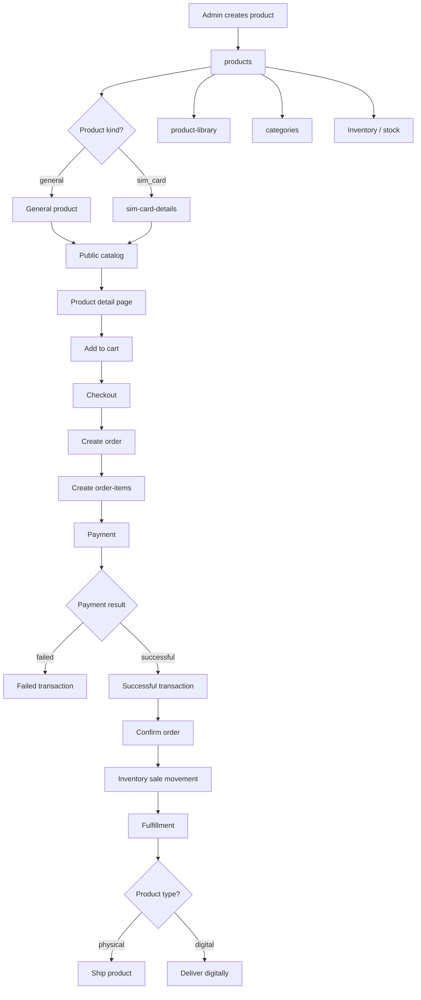
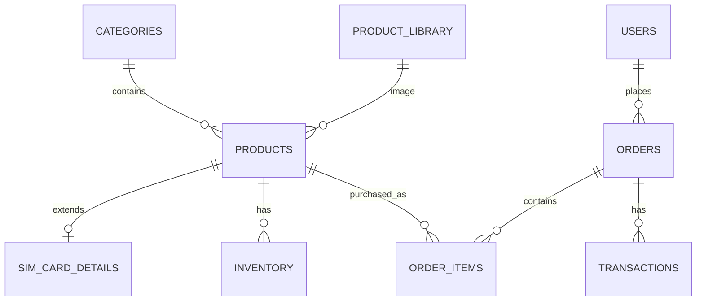
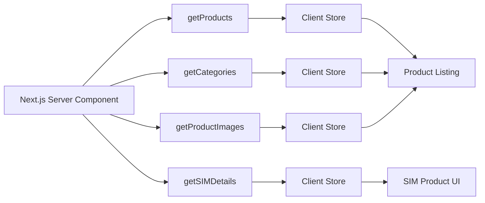
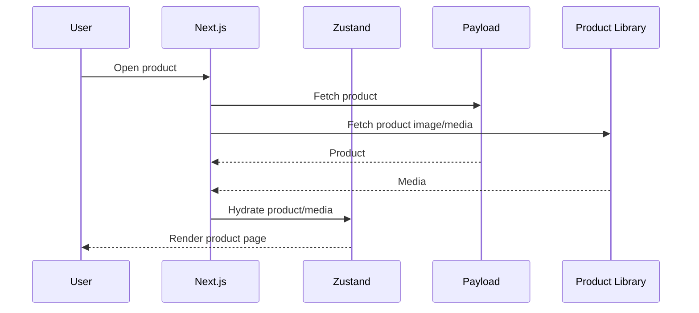
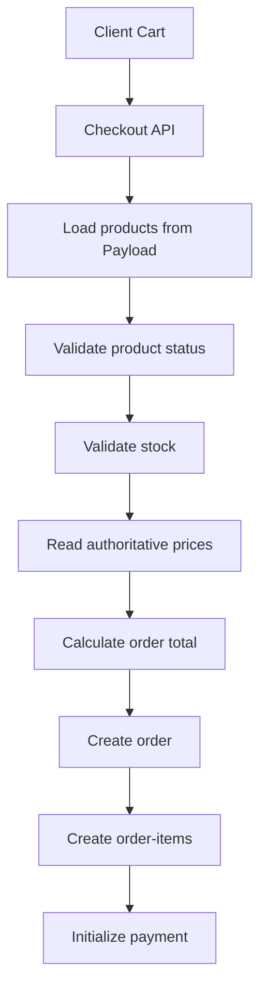
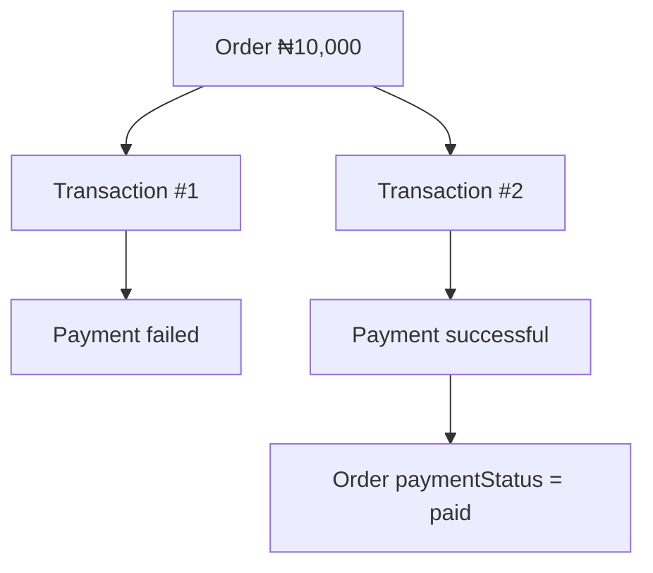
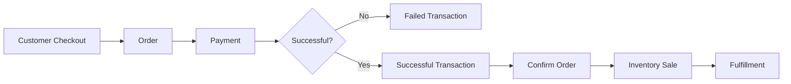
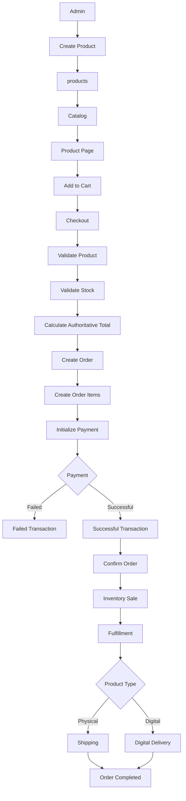

# TVH Ecommerce — Product Architectural Flow

## 1. Purpose

This document describes how a product moves through the TVH ecommerce system, from creation in Payload CMS through catalog presentation, cart, checkout, order creation, payment, fulfillment, and inventory updates.

The architecture is intentionally separated into domain responsibilities so that:

- `products` represents the catalog.
- `categories` organizes products.
- `product-library` stores reusable product media.
- `sim-card-details` extends products with SIM-specific data.
- `orders` represents what a customer purchased.
- `order-items` preserves the historical product snapshot.
- `transactions` represents financial events.
- `inventory` represents stock movements.

---

## 2. Core Collections

| Collection | Responsibility |
|---|---|
| `users` | Customers and administrators |
| `categories` | Product classification |
| `product-library` | Product images and reusable media |
| `products` | Main product catalog |
| `sim-card-details` | SIM-specific product attributes |
| `inventory` | Immutable stock movement history |
| `orders` | Customer purchases |
| `order-items` | Products purchased within an order |
| `transactions` | Payment and financial history |

---

## 3. High-Level Product Flow



---

# 4. Product Creation

Products are created and managed through Payload CMS.

The `products` collection is the source of truth for catalog information.

A product contains common information such as:

```text
name
description
productImage
productType
productKind
status
stock
badges
price
currency
country
category
```

### Product classification

Two dimensions are intentionally separated:

```text
productType = how the product is fulfilled

productKind = what the product is
```

Examples:

| Product | `productType` | `productKind` |
|---|---|---|
| Physical SIM | `physical` | `sim_card` |
| eSIM | `digital` | `sim_card` |
| Phone | `physical` | `general` |
| Digital guide | `digital` | `general` |

This prevents fulfillment logic from becoming mixed with product-domain classification.

---

# 5. Product Relationships



The most important relationship is:

```text
products
   │
   ├── category ────────> categories
   │
   ├── productImage ────> product-library
   │
   ├── SIM product ─────> sim-card-details
   │
   ├── stock ───────────> current inventory snapshot
   │
   └────────────────────> order-items
```

---

# 6. Product Library

`product-library` is responsible for reusable media.

Instead of storing image data directly inside every product:

```text
products
   └── productImage ──> product-library
```

This allows the same media system to be reused across:

- products
- banners
- content blocks
- marketing sections
- other catalog surfaces

The frontend can independently load product records and media records.

---

# 7. SIM Card Extension

SIM-specific information should not make the general `products` collection unnecessarily large.

Instead:

```text
products
     │
     │ 1 : 1
     ▼
sim-card-details
```

For example:

```text
products
├── name
├── price
├── productType = digital
├── productKind = sim_card
└── ...

sim-card-details
├── simType = esim
├── network
├── plan
├── data
└── validity
```

This gives the system a polymorphic-style product model while keeping the core product schema clean.

---

# 8. Catalog Visibility

A product should not automatically become purchasable just because it exists.

The catalog should evaluate at least:

```text
product.status
product.stock
```

Typical lifecycle:

```text
draft
  │
  ▼
active
  │
  ├── stock > 0 ──> available
  │
  └── stock = 0 ──> out of stock
  │
  ▼
inactive
  │
  ▼
archived
```

`out of stock`, `low stock`, and `in stock` should generally be derived from inventory rather than persisted as product status values.

---

# 9. Frontend Data Flow

TVH uses independent relational loading instead of deeply populated Payload relationships.

The preferred pattern is:



This avoids large deeply nested Payload responses.

For example:

```ts
const [
  { docs: products },
  { docs: categories },
] = await Promise.all([
  getProducts(),
  getCategories(),
]);
```

The client then hydrates independent Zustand stores.

---

# 10. Product Store Architecture

The product store acts as a client-side cache.

Payload remains the source of truth.

```text
Payload
   │
   ▼
Server fetch
   │
   ▼
Zustand productStore
   │
   ├── Product listing
   ├── Product detail
   ├── Filters
   └── Cart/product selection
```

The store should distinguish:

```text
idle
loading
ready
error
```

This is important because:

```text
ready + zero products
```

means:

> The catalog was successfully loaded and contains no products.

Whereas:

```text
idle/loading
```

means:

> We do not yet know whether products exist.

And:

```text
error
```

means:

> The product request failed.

---

# 11. Product Detail Flow



The product page should be able to render useful sections independently.

For example:

```text
Product information
      │
      ├── Product details
      ├── Product image
      ├── Category
      ├── SIM details
      ├── Price
      └── Inventory state
```

---

# 12. Add to Cart

The cart represents the customer's current purchase intent.

For a basic ecommerce implementation, the cart does not necessarily need its own database collection.

It can initially live client-side:

```text
Product
   │
   ▼
Add to cart
   │
   ▼
Zustand cart store
   │
   ├── productId
   ├── quantity
   └── selected options
```

The server must **not trust the client-side price**.

At checkout, the server re-reads product information from Payload.

---

# 13. Checkout

The checkout process should validate the cart against the current server state.



The server should calculate:

```text
subtotal
shipping
discount
tax
total
```

rather than accepting the client's calculated total.

---

# 14. Order Item Snapshot

This is one of the most important parts of the architecture.

An `order-item` references the product but also stores a historical snapshot.

```text
order-items
├── order
├── product
├── name
├── quantity
├── unitPrice
├── totalPrice
└── currency
```

Why?

Because catalog data changes.

Example:

```text
2026-01-01

Product:
Lebara SIM
Price: ₦5,000
```

Customer purchases it.

Later:

```text
2026-06-01

Product:
Lebara SIM
Price: ₦7,000
```

The old order must still display:

```text
Lebara SIM
₦5,000
```

Therefore:

```text
Product = current catalog state

Order Item = historical purchase state
```

---

# 15. Payment and Transactions

An order and a transaction are different concepts.

```text
Order
"What did the customer purchase?"

Transaction
"What happened to the money?"
```

One order can have multiple transactions.

Example:



This allows failed payment attempts to remain part of the financial history.

Refunds should also be recorded as new financial events rather than rewriting the original successful payment.

---

# 16. Inventory Flow

Inventory represents physical/deliverable stock, not money.

Current product stock:

```text
products.stock
```

Inventory history:

```text
inventory
```

Example:

```text
Initial stock
     │
     ▼
Restock +10
     │
     ▼
Stock = 10
     │
     ▼
Sale -2
     │
     ▼
Stock = 8
```

The inventory record should preserve:

```text
quantityBefore
quantity
quantityAfter
type
reference
createdBy
createdAt
```

Inventory records should be treated as immutable history.

---

# 17. Order → Payment → Inventory

The important business flow is:



The financial and inventory events are deliberately separate.

For example:

```text
Transaction
PAYMENT
+₦10,000
successful
```

and:

```text
Inventory
SALE
-2 units
```

These are two different domain events.

---

# 18. Fulfillment by Product Type

`productType` determines the fulfillment model.

### Physical

```text
payment successful
       │
       ▼
order confirmed
       │
       ▼
processing
       │
       ▼
shipped
       │
       ▼
delivered
```

### Digital

```text
payment successful
       │
       ▼
order confirmed
       │
       ▼
digital fulfillment
       │
       ▼
completed
```

For an eSIM:

```text
payment successful
       │
       ▼
order confirmed
       │
       ▼
provision eSIM
       │
       ▼
deliver activation details
       │
       ▼
completed
```

---

# 19. Complete Ecommerce Flow



---

# 20. Domain Ownership

Each collection should have a clear responsibility.

```text
┌──────────────────────────────────────────────┐
│                  CATALOG                     │
│                                              │
│  categories                                  │
│      │                                       │
│      ▼                                       │
│  products ─────── product-library            │
│      │                                       │
│      └──────────── sim-card-details           │
└──────────────────────────────────────────────┘

                    │
                    ▼

┌──────────────────────────────────────────────┐
│                   SALES                      │
│                                              │
│  orders                                      │
│      │                                       │
│      └────── order-items ───── products      │
└──────────────────────────────────────────────┘

                    │
          ┌─────────┴─────────┐
          ▼                   ▼

┌──────────────────┐   ┌──────────────────────┐
│    FINANCIAL     │   │      INVENTORY       │
│                  │   │                      │
│  transactions    │   │  inventory movements │
└──────────────────┘   └──────────────────────┘
```

---

# 21. Source of Truth

The system should maintain a clear hierarchy.

| Data | Source of truth |
|---|---|
| Product name | `products` |
| Product price | `products` |
| Product status | `products` |
| Current stock | `products.stock` |
| Stock history | `inventory` |
| Product category | `categories` |
| Product media | `product-library` |
| SIM attributes | `sim-card-details` |
| Current order state | `orders` |
| Historical purchased price | `order-items` |
| Payment history | `transactions` |
| Customer identity | `users` |

The frontend Zustand stores are **caches**, not authoritative sources.

---

# 22. Important Invariants

### Product

```text
product.status = active
```

does not necessarily mean:

```text
product.stock > 0
```

A product can be active but out of stock.

---

### Order

An order should contain immutable purchase information through its order items.

Do not recalculate historical order totals from today's product prices.

---

### Transaction

Transactions represent financial history.

Avoid deleting or rewriting financial records.

---

### Inventory

Inventory records represent stock history.

Avoid editing or deleting historical inventory movements.

---

### Checkout

Never trust:

```text
client price
client total
client stock
```

The server must validate all three against authoritative data.

---

# 23. Recommended V1 Collections

```text
users
│
├── categories
│
├── product-library
│
├── products
│   └── sim-card-details
│
├── inventory
│
├── orders
│   └── order-items
│
└── transactions
```

This is a strong foundation for a basic ecommerce store without introducing unnecessary complexity.

---

# 24. Future Extensions

Only introduce these when the business actually needs them:

```text
product-variants
wishlists
reviews
coupons
discounts
shipping-zones
shipping-rates
returns
refunds
subscriptions
gift-cards
promotions
abandoned-carts
```

The current architecture leaves room for these without requiring the core product model to be redesigned.

---

# 25. Architectural Principle

The most important rule is:

> **Keep catalog, sales, financial, and inventory concerns separate.**

```text
Product
"What do we sell?"

Order
"What did the customer buy?"

Order Item
"What exactly did they buy at that point in time?"

Transaction
"What happened to the money?"

Inventory
"What happened to the stock?"
```

This separation keeps the TVH ecommerce system predictable, auditable, and extensible while remaining simple enough for a basic V1 store.
